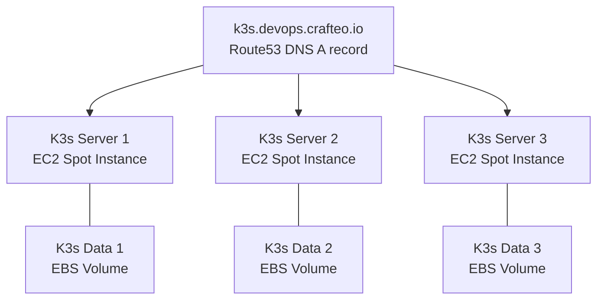

# DevOps Lifecycle Playground

Playground project demonstrating DevOps lifecycle implementation for a small application and infrastructure:

## Infrastructure

Kubernetes HA cluster ([K3S](https://rancher.com/docs/k3s/latest/en/)) running on AWS with EC2 Spot Instances.



Directory structure:

```
├─ infra/   # Infrastructure stacks managed with Pulumi
│  ├─ aws/  # AWS infra (EC2, DNS record...)
│  ├─ k8s/  # Kubernetes infra (Traefik, Cert Manager...)
├─ deploy/  # Deploy app as Docker image on Kubernetes cluster with Kustomize
├─ src/     # Application source code
```

## Usage

Define configuration for your stack using `infra/aws/Pulumi.template.yaml`. Make sure to have SSH Private key available.

Deploy infrastructure (K3S running on EC2):

```
pulumi -C infra/aws up -s dev -yf
```

Check K3S has been properly installed:

```
ssh -i infra/aws/.ssh/dev ubuntu@k3s-1.devops.crafteo.io k3s --version
```

Retrieve Kubeconfig and deploy Kubernetes components with a command like:

```
# Kubeconfig file to use
# Provide full path so that we won't look for it via relative path
export KUBECONFIG=$PWD/infra/k8s/.kubeconfig.yml

# -i points to the private key matching sshKeyPair config
# Replace hostname by hostname matching your hosted zone
scp -i infra/aws/.ssh/dev ubuntu@k3s-1.devops.crafteo.io:/etc/rancher/k3s/k3s.yaml $KUBECONFIG

# replace 127.0.0.1 by your domain name
sed -i 's/127.0.0.1/k3s-1.devops.crafteo.io/g' $KUBECONFIG

# check server is available with nodes
kubectl get no
```

Cert Manager use Route53 for DNS challenge. An IAM user has been created for this purpose, we need to provide credentials to Cert Manager:

- Generate credentials for `certManagerIAMUser` IAM User
- Create file `infra/k8s/kustomize/base/secret-access-key` with Secret Key (will be used to generate secret)
- Update `infra/k8s/kustomize/base/ClusterIssuer.yml` with Access Key ID such as `accessKeyID: AKIAXXX`

Deploy Kubernetes resources (Traefik, CertManager...)

```
pulumi -C infra/k8s up -s dev -yf
```

Deploy application and expose-it via Ingress:

```
kubectl -k deploy/kustomize/base/ apply
```