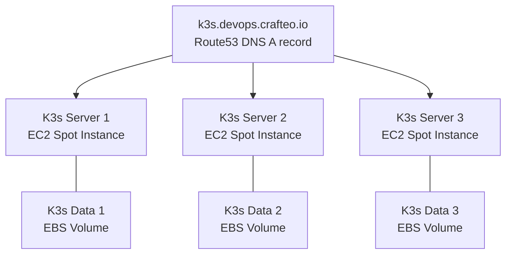

# DevOps Lifecycle Playground

Playground project demonstrating DevOps lifecycle implementation for a small application and infrastructure:

## Infrastructure

Kubernetes HA cluster ([K3S](https://rancher.com/docs/k3s/latest/en/)) running on AWS with EC2 Spot Instances.



Directory structure:

```
├─ infra/   # Infrastructure stacks managed with Pulumi
│  ├─ aws/  # AWS infra (EC2, DNS record...)
│  ├─ k8s/  # Kubernetes infra (Traefik, Cert Manager...)
├─ deploy/  # Deploy app as Docker image on Kubernetes cluster with Kustomize
├─ src/     # Application source code
```

## Usage

Available stacks:

HA Kubernetes cluster (K3S) running on AWS EC2 spot instances

```
# Deploy Kubernetes cluster with Traefik and Cert Manager
make infra

# Only Kubernetes cluster (K3S) on AWS
make aws
```

Traefik with Cert Manager (using ACME DNS challenge via AWS Route53)

```
make traefik
```

Datadog deployment

```
# Datadog API key is required, create config from template and set API key
cp infra/datadog/helm/secrets-datadog.template.yml infra/datadog/helm/secrets-datadog.yml
nano infra/datadog/helm/secrets-datadog.yml

make datadog
```

Simple whoami container, handy to test overall accessibility and Traefik/Cert Manager deployment:

```
make whoami
```

Docker Example Voting App using adapated Kustomize (see [Docker Samples - Example Voting App repo](https://github.com/dockersamples/example-voting-app))

```
make vote
```